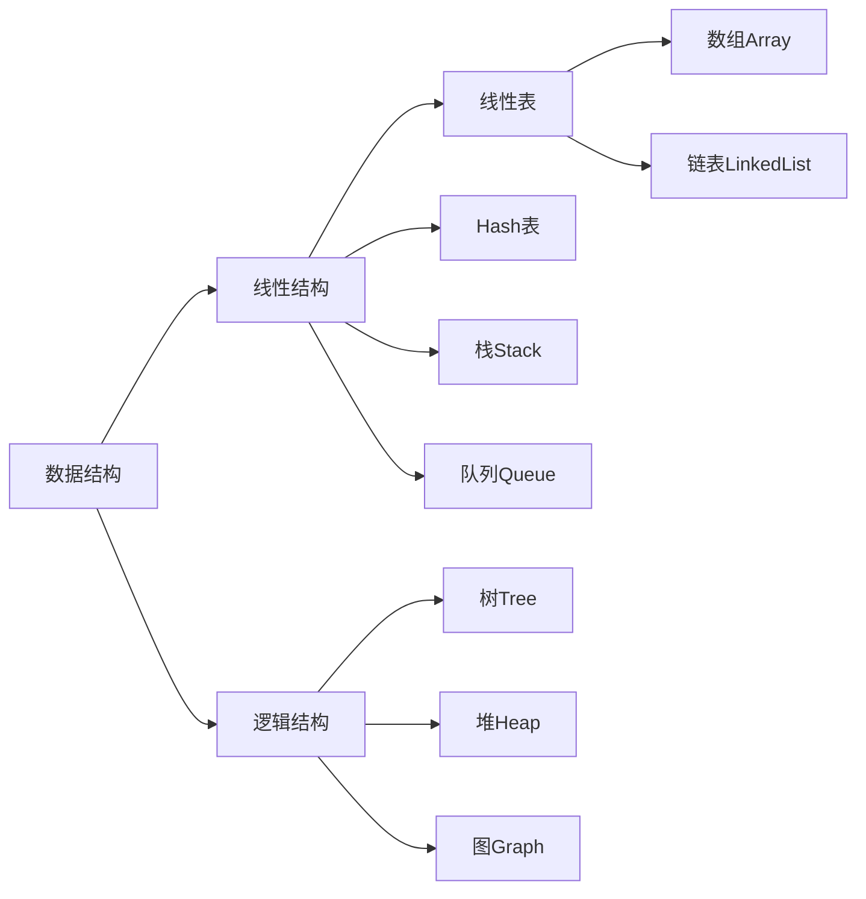

# Data Structures Overview




```java
package org.data.structurs.graph;

import java.util.Arrays;
import java.util.Vector;

public class Graph {

    private int n;  // 节点数
    private int m;  // 边数
    private boolean directed;    // 是否为有向图
    private Vector<Integer>[] adjacency; // 图的具体数据

    // 构造函数
    public Graph(int n, boolean directed) {
        assert n >= 0;
        this.n = n;
        this.m = 0;    // 初始化没有任何边
        this.directed = directed;
        // g初始化为n个空的vector, 表示每一个g[i]都为空, 即没有任和边
        this.adjacency = (Vector<Integer>[]) new Vector[n];
        for (int i = 0; i < n; i++)
            this.adjacency[i] = new Vector<Integer>();
    }

    public int V() {
        return n;
    } // 返回节点个数

    public int E() {
        return m;
    } // 返回边的个数

    // 向图中添加一个边
    public void addEdge(int v, int w) {
        assert v >= 0 && v < n;
        assert w >= 0 && w < n;
        this.adjacency[v].add(w);
        if (v != w && !directed)
            this.adjacency[w].add(v);
        m++;
    }

    // 验证图中是否有从v到w的边
    boolean hasEdge(int v, int w) {
        assert v >= 0 && v < n;
        assert w >= 0 && w < n;
        for (int i = 0; i < this.adjacency[v].size(); i++)
            if (this.adjacency[v].elementAt(i) == w)
                return true;
        return false;
    }

    // 返回图中一个顶点的所有邻边
    // 由于java使用引用机制，返回一个Vector不会带来额外开销,
    public Iterable<Integer> adj(int v) {
        assert v >= 0 && v < n;
        return this.adjacency[v];
    }

    @Override
    public String toString() {
        return "Graph{" +
                "n=" + n +
                ", m=" + m +
                ", directed=" + directed +
                ", adjacency=" + Arrays.toString(adjacency) +
                '}';
    }

    public static void main(String[] args) {
        //初始化一个有5个节点的图
        Graph graph = new Graph(5, true);
        System.out.println(graph);
        //添加节点之间的关系
        graph.addEdge(0, 1);
        graph.addEdge(0, 2);
        graph.addEdge(0, 3);
        graph.addEdge(1, 2);
        graph.addEdge(2, 4);

        System.out.println(graph);
    }
}
```